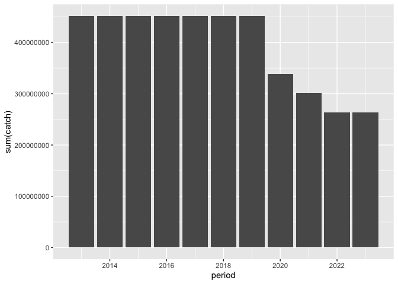
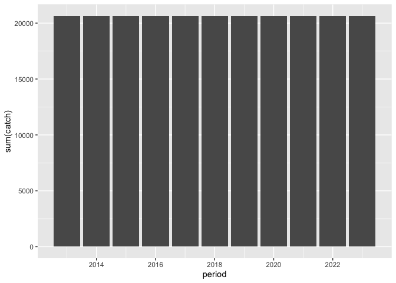

## Instructions
Answer the following questions and/or complete the exercises in RMarkdown. Please embed all of your code and push the final work to your repository. Your report should be organized, clean, and run free from errors. Remember, you must remove the `#` for any included code chunks to run.  

## Load the libraries

``` r
library("tidyverse")
library("janitor")
library("naniar")
options(scipen = 999)
```

## About the Data
For this assignment we are going to work with a data set from the [United Nations Food and Agriculture Organization](https://www.fao.org/fishery/en/collection/capture) on world fisheries. These data were downloaded and cleaned using the `fisheries_clean.Rmd` script.  

Load the data `fisheries_clean.csv` as a new object titled `fisheries_clean`.

``` r
fisheries_clean <- read_csv("data/fisheries_clean.csv")
```

1. Explore the data. What are the names of the variables, what are the dimensions, are there any NA's, what are the classes of the variables, etc.? You may use the functions that you prefer.

``` r
fisheries_clean %>% 
  names()
```

```
## [1] "period"          "continent"       "geo_region"      "country"        
## [5] "scientific_name" "common_name"     "taxonomic_code"  "catch"          
## [9] "status"
```

2. Convert the following variables to factors: `period`, `continent`, `geo_region`, `country`, `scientific_name`, `common_name`, `taxonomic_code`, and `status`.

``` r
fisheries_clean %>% 
  mutate(across(c(period,continent,geo_region,country,scientific_name, common_name,taxonomic_code,status),as.factor))
```

```
## # A tibble: 1,055,015 × 9
##    period continent geo_region    country     scientific_name common_name       
##    <fct>  <fct>     <fct>         <fct>       <fct>           <fct>             
##  1 1950   Asia      Southern Asia Afghanistan Osteichthyes    Freshwater fishes…
##  2 1951   Asia      Southern Asia Afghanistan Osteichthyes    Freshwater fishes…
##  3 1952   Asia      Southern Asia Afghanistan Osteichthyes    Freshwater fishes…
##  4 1953   Asia      Southern Asia Afghanistan Osteichthyes    Freshwater fishes…
##  5 1954   Asia      Southern Asia Afghanistan Osteichthyes    Freshwater fishes…
##  6 1955   Asia      Southern Asia Afghanistan Osteichthyes    Freshwater fishes…
##  7 1956   Asia      Southern Asia Afghanistan Osteichthyes    Freshwater fishes…
##  8 1957   Asia      Southern Asia Afghanistan Osteichthyes    Freshwater fishes…
##  9 1958   Asia      Southern Asia Afghanistan Osteichthyes    Freshwater fishes…
## 10 1959   Asia      Southern Asia Afghanistan Osteichthyes    Freshwater fishes…
## # ℹ 1,055,005 more rows
## # ℹ 3 more variables: taxonomic_code <fct>, catch <dbl>, status <fct>
```

3. Are there any missing values in the data? If so, which variables contain missing values and how many are missing for each variable?


4. How many countries are represented in the data?

``` r
fisheries_clean %>% 
  summarize(n_distinct(country))
```

```
## # A tibble: 1 × 1
##   `n_distinct(country)`
##                   <int>
## 1                   249
```

5. The variables `common_name` and `taxonomic_code` both refer to species. How many unique species are represented in the data based on each of these variables? Are the numbers the same or different?

``` r
fisheries_clean %>% 
  summarize(n_distinct(taxonomic_code),n_distinct(common_name))
```

```
## # A tibble: 1 × 2
##   `n_distinct(taxonomic_code)` `n_distinct(common_name)`
##                          <int>                     <int>
## 1                         3722                      3390
```

6. In 2023, what were the top five countries that had the highest overall catch?

``` r
fisheries_clean %>% 
  select(country,catch,period) %>% 
  filter(period=="2023") %>% 
  group_by(country) %>% 
  summarize(total_catch=sum(catch)) %>% 
  arrange(desc(total_catch)) %>% 
  head(5)
```

```
## # A tibble: 5 × 2
##   country                  total_catch
##   <chr>                          <dbl>
## 1 China                      13424705.
## 2 Indonesia                   7820833.
## 3 India                       6177985.
## 4 Russian Federation          5398032 
## 5 United States of America    4623694
```

7. In 2023, what were the top 10 most caught species? To keep things simple, assume `common_name` is sufficient to identify species. What does `NEI` stand for in some of the common names? How might this be concerning from a fisheries management perspective?

``` r
fisheries_clean %>% 
  select(common_name,catch,period) %>% 
  filter(period=="2023") %>% 
  group_by(common_name) %>% 
  summarize(total_catch=sum(catch)) %>% 
  arrange(desc(total_catch)) %>% 
  head(10)
```

```
## # A tibble: 10 × 2
##    common_name                    total_catch
##    <chr>                                <dbl>
##  1 Marine fishes NEI                 8553907.
##  2 Freshwater fishes NEI             5880104.
##  3 Alaska pollock(=Walleye poll.)    3543411.
##  4 Skipjack tuna                     2954736.
##  5 Anchoveta(=Peruvian anchovy)      2415709.
##  6 Blue whiting(=Poutassou)          1739484.
##  7 Pacific sardine                   1678237.
##  8 Yellowfin tuna                    1601369.
##  9 Atlantic herring                  1432807.
## 10 Scads NEI                         1344190.
```

8. For the species that was caught the most above (not NEI), which country had the highest catch in 2023?

``` r
fisheries_clean %>% 
  select(country,catch,period,common_name) %>% 
  filter(period=="2023"& common_name=="Alaska pollock(=Walleye poll.)") %>% 
  group_by(country) %>% 
  summarize(total_catch=sum(catch)) %>% 
  arrange(desc(total_catch)) %>% 
  head(1)
```

```
## # A tibble: 1 × 2
##   country            total_catch
##   <chr>                    <dbl>
## 1 Russian Federation     1893924
```

9. How has fishing of this species changed over the last decade (2013-2023)? Create a  plot showing total catch by year for this species.

``` r
fisheries_clean %>% 
  filter(common_name=="Alaska pollock(=Walleye poll.)" & period>"2012" & period<"2024") %>% 
  group_by(period) %>% 
  ggplot(mapping=aes(x=period,y=sum(catch)))+
  geom_col()
```

<!-- -->

10. Perform one exploratory analysis of your choice. Make sure to clearly state the question you are asking before writing any code.

I would like to see how fishing in afghanistan has changed between 2013 and 2023

``` r
fisheries_clean %>% 
  filter(country=='Afghanistan' & period>"2012" & period<"2024") %>% 
  group_by(period) %>% 
  ggplot(mapping=aes(x=period,y=sum(catch)))+
  geom_col()
```

<!-- -->

## Knit and Upload
Please knit your work as an .html file and upload to Canvas. Homework is due before the start of the next lab. No late work is accepted. Make sure to use the formatting conventions of RMarkdown to make your report neat and clean!  
